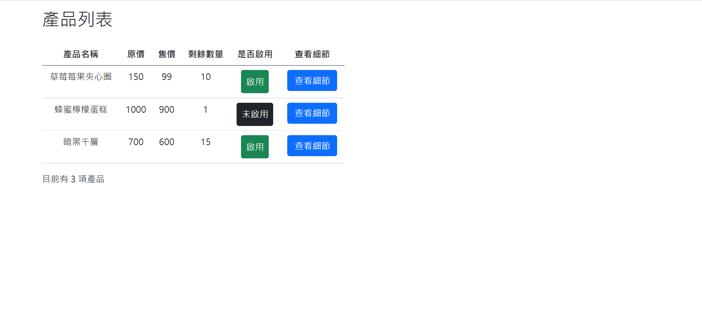

# Vue 作品實戰 2022 春季班 Week2 主線任務

## [Demo](https://sylvia-h.github.io/Hex_Vue_week2/)

## 專案重點

### 登入頁面

* 完成帳號密碼驗證後，將回傳的 token 以 cookie 形式儲存

### 後台產品列表

* 點擊可切換**產品狀態**（啟用/未啟用）

* 點擊**查看細節**按鈕，則右側面板會顯示所點擊的產品細節內容

* 右側面板所顯示的產品圖片是由不同的資料集所提取

## 使用技術與套件列表

* SCSS
* Bootstrap 5
* axios
* Vue.js
